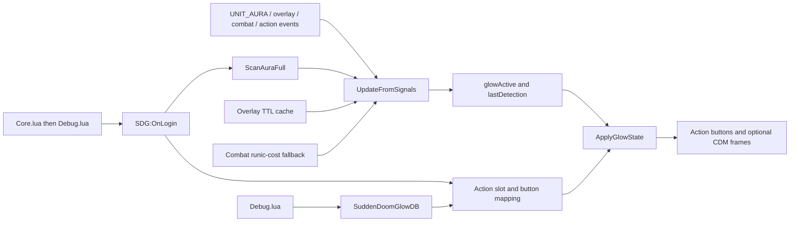

# Code graph

```mermaid
flowchart LR
  TOC[Core.lua then Debug.lua] --> Login[SDG:OnLogin]
  Login --> Map[Action slot and button mapping]
  Login --> Aura[ScanAuraFull]
  Events[UNIT_AURA / overlay / combat / action events] --> Signals[UpdateFromSignals]
  Aura --> Signals
  Overlay[Overlay TTL cache] --> Signals
  Cost[Combat runic-cost fallback] --> Signals
  Signals --> State[glowActive and lastDetection]
  State --> Render[ApplyGlowState]
  Map --> Render
  Render --> Buttons[Action buttons and optional CDM frames]
  Debug[Debug.lua] --> DB[SuddenDoomGlowDB]
  DB --> Map
```
