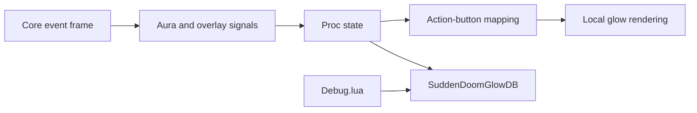

# Code graph

```mermaid
flowchart LR
  Events[Core event frame] --> Signals[Aura and overlay signals]
  Signals --> State[Proc state]
  State --> Map[Action-button mapping]
  Map --> Render[Local glow rendering]
  Debug[Debug.lua] --> DB[SuddenDoomGlowDB]
  State --> DB
```
