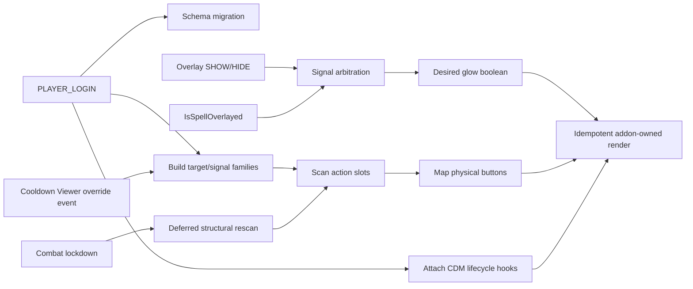

# Code graph

```mermaid
flowchart LR
    Login[PLAYER_LOGIN] --> DB[Schema migration]
    Login --> Family[Build target/signal families]
    Family --> Slots[Scan action slots]
    Slots --> Buttons[Map physical buttons]
    Login --> CDM[Attach CDM lifecycle hooks]

    ShowHide[Overlay SHOW/HIDE] --> Arbitration[Signal arbitration]
    Query[IsSpellOverlayed] --> Arbitration
    Override[Cooldown Viewer override event] --> Family
    Arbitration --> State[Desired glow boolean]
    State --> Render[Idempotent addon-owned render]
    Buttons --> Render
    CDM --> Render

    Combat[Combat lockdown] --> Deferred[Deferred structural rescan]
    Deferred --> Slots
```
